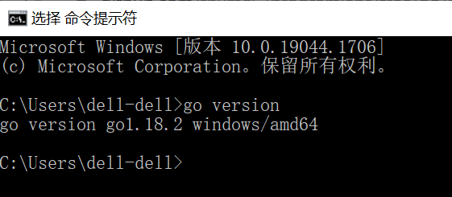
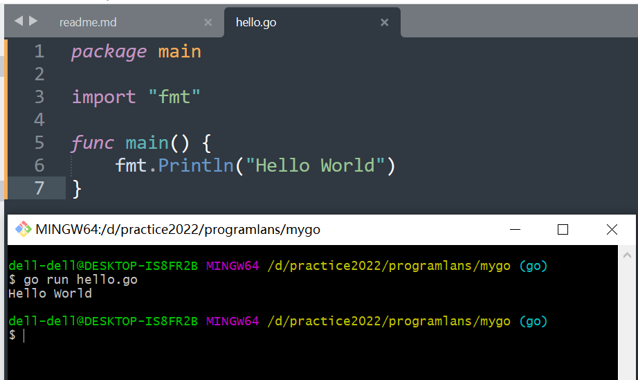
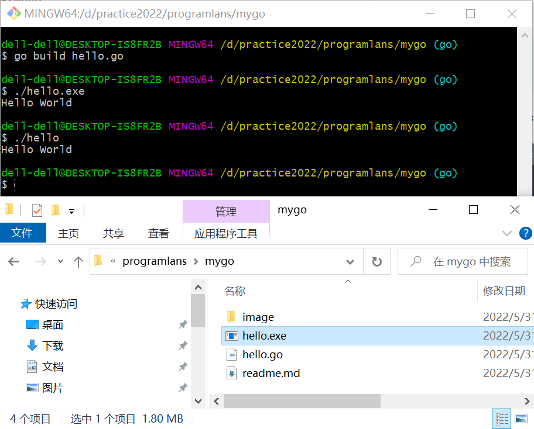

# GO 

## Installation
[Download](https://go.dev/dl/) the go and install

check installation in cmd
`go version`

## Build and Run
run hello world
```
cd ~/mygo
go run hello.go
```

`go run` command execute build, link, run in one



build hello world without run
```
cd ~/mygo
go build hello.go
./hello
```
`go build` command will generate hello.exe


